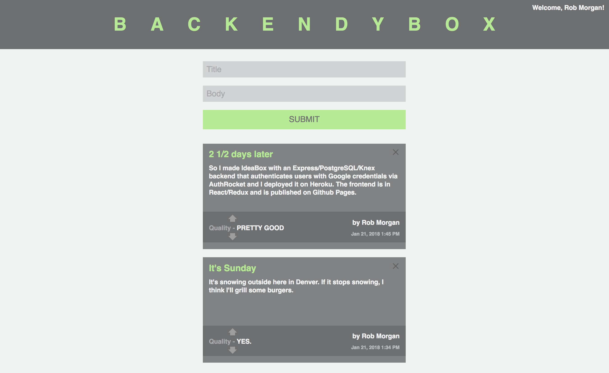

## Backendy-Box

This is a simple app made when I had a few days to kill.  I wanted to get better at building APIs and managing authentication.

This backend repo contains an Express/Node.js/PostgreSQL/Knex backend.  It is deployed via Heroku.

The frontend is published on Github pages.

In Backendy-Box users are logged in with Google credentials, can write comments or ideas with a title and a body.  You can manage the quality of the comment at the bottom.  It also displays the author and the time automatically.  There is just one message board for all users, meaning, any authenticated user can change what's on the board.

The frontend and backend including idea, design, build, and deployment were built in less than 3 days.

Feel free to checkout the live version and leave me a message:
https://rmorgan323.github.io/backendy-box-FE/

See the frontend repo at:
https://github.com/rmorgan323/backendy-box-FE

